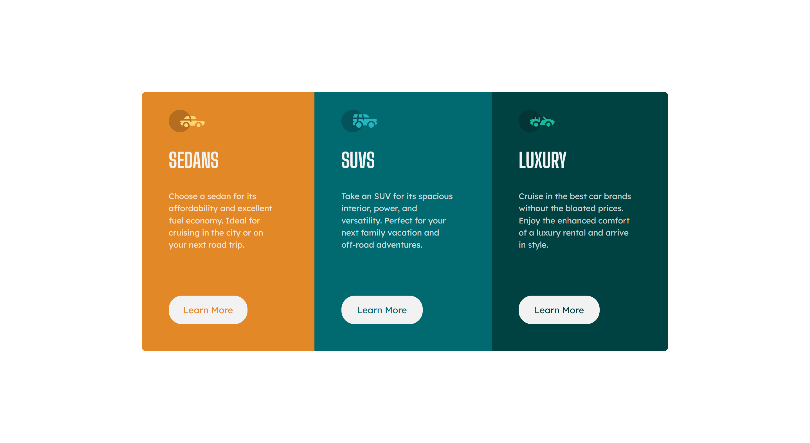

# 3-column preview card component

### This is a solution to the [3-column preview card component challenge on Frontend Mentor](https://www.frontendmentor.io/challenges/3column-preview-card-component-pH92eAR2-)

### I have created this project with the purpose of enhancing my website designing skills!

### Built with:
#### - HTML
#### - Scss

## Screenshots

### Desktop

    

### Mobile Phone

    

